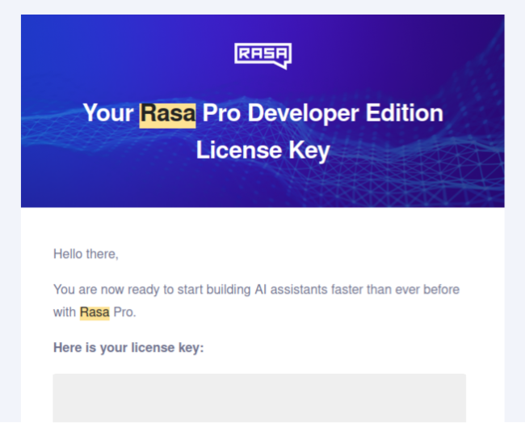
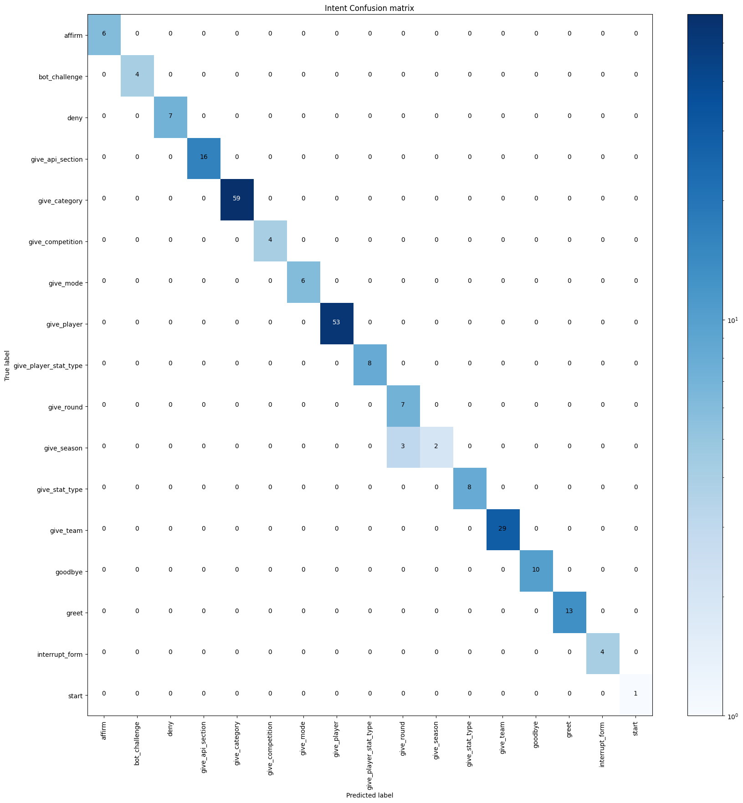
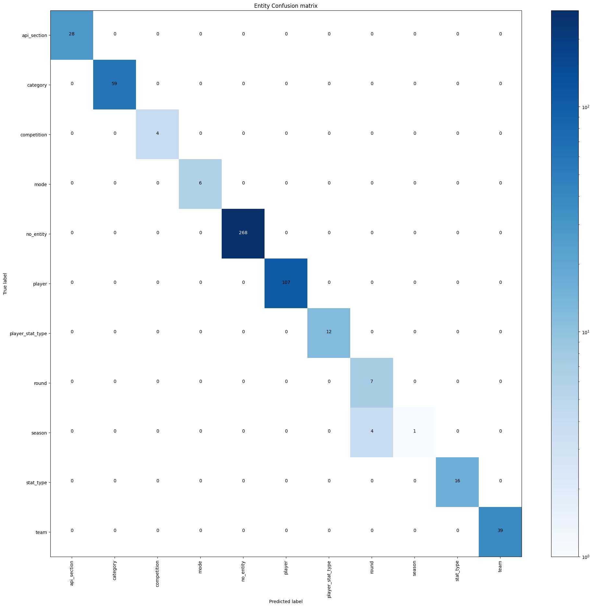
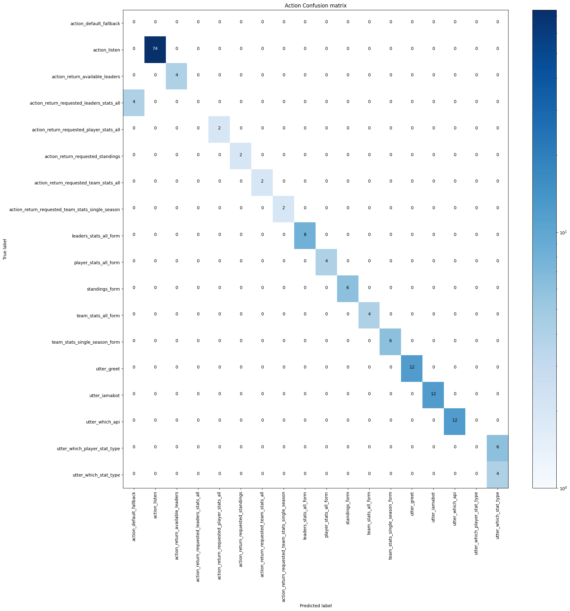
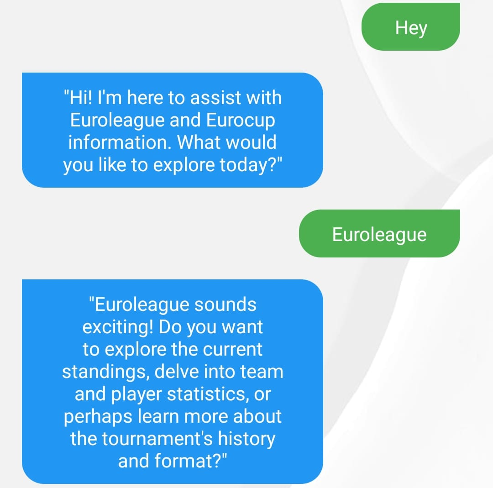

<div align="center">
    
</div>

---

> A chatbot developed using **Rasa** and **Python** to answer questions related to the Euroleague and Eurocup, 
> leveraging the [euroleague_api](https://github.com/giasemidis/euroleague_api) by
> [Georgios Giasemidis](https://github.com/giasemidis).

## Table of Contents
1. [Installation](#installation-) 📥
2. [Usage](#usage-) 🔨 ️
   1. [Start Chatting](#start-chatting-) 💬
   2. [Test and Evaluate Rasa Model](#test-and-evaluate-rasa-model-) 🧪
3. [Evaluation](#evaluation-) 📊
4. [Limitations](#limitations-) ⛔
5. [Demo](#demo-) 🎥
6. [Future Work](#future-work-) 🚀

## Installation 📥

### 1. Clone the Repository:
```shell
git clone https://github.com/julenfu21/EurolIAgueAssistant.git
```

### 2. Create a Virtual Environment

#### Using `venv`:
   1. Move to the project directory: 
   ```shell
   cd EurolIAgueAssistant
   ```
      
   2. Create a new virtual environment:
   ```shell
   python -m venv ./venv
   ```
      
   3. Activate the virtual environment:
      - On macOS/Linux:
      ```shell
      source ./venv/bin/activate
      ```
      
      - On Windows:
      ```shell
      .\venv\Scripts\activate
      ```
     
#### Using `conda`
   1. Move to the project directory: 
   ```shell
   cd EurolIAgueAssistant
   ```
      
   2. Create a new virtual environment:
   ```shell
   conda create -n myenv python
   ```
      
   3. Activate the virtual environment:
   ```shell
   conda activate myenv
   ``` 

### 3. Install and Set Up Rasa Package
   1. Add the Rasa package repository to the `pip.conf` file so that *pip* can locate the `rasa-pro` package:
   ```shell
   cat <<EOF >> venv/pip.conf
   [global]
   extra-index-url = https://europe-west3-python.pkg.dev/rasa-releases/rasa-pro-python/simple/
   EOF
   ```

   2. Install the `rasa-pro` package:
   ```shell
   pip install rasa-pro
   ```   

   3. Obtain a Rasa Pro license key following the instructions at 
   [Rasa Webpage - Rasa Pro License Key Request](https://rasa.com/rasa-pro-developer-edition-license-key-request/)
   section. After completing the steps, a message similar to the one below will be received with the Rasa Pro license
   key:

   <div align="center">
      
   </div>
   
   4. Set the `RASA_PRO_LICENSE` environment variable:
      - Temporary:
      ```shell
      export RASA_PRO_LICENSE=<your-license-string>
      ```
      
      - Persistent:
      ```shell
      echo "export RASA_PRO_LICENSE=<your-license-string>" >> ~/.bashrc
      source ~/.bashrc
      ```

## Usage 🔨

### Start chatting 💬

1. Train a new Rasa model:
```shell
rasa train
```

2. Test the Rasa model (opening 2 different terminals)
   1. In the first terminal, initialize the action server (necessary to run **custom actions**):
   ```shell
   rasa run actions
   ```
   
   2. In the second terminal, start a chat session:
      - Conventional chat session:
      ```shell
      rasa shell
      ```
      
      - Interactive chat session (ideal for debugging):
      ```shell
      rasa interactive
      ```

### Test and evaluate Rasa model 🧪
Run the following command to test the model:

```shell
rasa test --stories tests/test_stories.yml 
```

## Evaluation 📊
After testing the model the following charts are obtained:

When it comes to the **intents** predicted by the Rasa model, the figure below shows that most of the time the
prediction is correct. However, it can be observed that more than half of the times the `give_season` is confused with 
the`give_round` intent.

<div align="center">
   
</div>

Regarding the **entities'** prediction, most of the predictions are correct, but once again the model struggles when 
trying to identify a `season` entity, which 80% of the times is predicted as a `round` entity.

<div align="center">
   
</div>

Finally, the actions to be performed by the chatbot are generally well predicted. Nonetheless, the model always fails
to predict the `action_return_requested_player_stats_all` and instead predicts an `action_default_fallback` (this
means that the model cannot identify an intent with enough confidence), and the `utter_which_player_stat_type` is
also mistaken with the `utter_which_stat_type` action.

<div align="center">
   
</div>

## Limitations ⛔
- **Euroleague-api** is still in development and may have some errors.
- The API is extensive, making it challenging to implement every section.
- Game schedules and data can vary between seasons.
- The rephrasing model may hallucinate, causing it to miss required slots or offer information about sections that
have not been implemented, as shown in the example below (our chatbot should not offer the possibility to ask about
the competition's history or the format).

- Limited visualization and design features.
- The number of stories might be limited.

## Demo 🎥
**PASTE VIDEO LINK**

## Future Work 🚀
- Expand the project with more stories and statistics.
- Implement the new [CALM](https://rasa.com/docs/rasa-pro/calm) approach (currently facing issues).
- Improve the GUI for better user experience.
- Enhance error handling to accept partially or fully incorrect inputs.
- Add slot validation via custom actions.
- Manage unhappy paths in the stories.