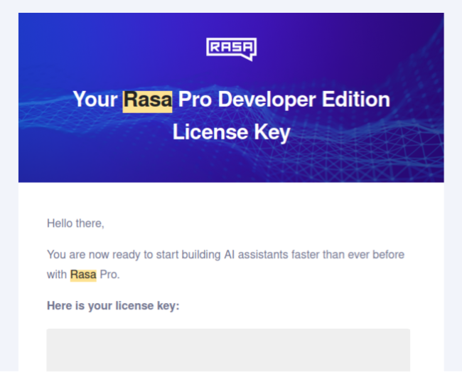

<div align="center">
    
</div>
<h1 align="center">
    EuroLAIgue Assistant
</h1>

> A chatbot developed using **Rasa** and **Python** to answer questions related to the Euroleague and Eurocup, 
> leveraging the [euroleague_api](https://github.com/giasemidis/euroleague_api) by
> [Georgios Giasemidis](https://github.com/giasemidis).

## Table of Contents
1. [Installation](#installation) 📥
2. [Usage](#usage) 🛠️
   1. [Start Chatting](#start-chatting) 💬
   2. [Test and Evaluate Rasa Model](#test-and-evaluate-rasa-model) 🧪

## Installation 📥

### 1. Clone the Repository:
```shell
git clone https://github.com/julenfu21/EurolIAgueAssistant.git
```

### 2. Create a Virtual Environment

#### Using `venv`:
   1. Move to the project directory: 
   ```shell
   cd EurolIAgueAssistant
   ```
      
   2. Create a new virtual environment:
   ```shell
   python -m venv ./venv
   ```
      
   3. Activate the virtual environment:
      - On macOS/Linux:
      ```shell
      source ./venv/bin/activate
      ```
      
      - On Windows:
      ```shell
      .\venv\Scripts\activate
      ```
     
#### Using `conda`
   1. **TO-DO**

### 3. Install and Set Up Rasa Package
   1. Add the Rasa package repository to the `pip.conf` file so that *pip* can locate the `rasa-pro` package:
   ```shell
   cat <<EOF >> venv/pip.conf
   [global]
   extra-index-url = https://europe-west3-python.pkg.dev/rasa-releases/rasa-pro-python/simple/
   EOF
   ```

   2. Install the `rasa-pro` package:
   ```shell
   pip install rasa-pro
   ```   

   3. Obtain a Rasa Pro license key following the instructions at 
   [Rasa Webpage - Rasa Pro License Key Request](https://rasa.com/rasa-pro-developer-edition-license-key-request/)
   section. After completing the steps, a message similar to the one below will be received with the Rasa Pro license
   key:
   
   
   4. Set the `RASA_PRO_LICENSE` environment variable:
      - Temporary:
      ```shell
      export RASA_PRO_LICENSE=<your-license-string>
      ```
      
      - Persistent:
      ```shell
      echo "export RASA_PRO_LICENSE=<your-license-string>" >> ~/.bashrc
      source ~/.bashrc
      ```

## Usage 🛠️

### Start chatting 💬

1. Train a new Rasa model:
```shell
rasa train
```

2. Test the Rasa model (opening 2 different terminals)
   1. In the first terminal, initialize the action server (necessary to run **custom actions**):
   ```shell
   rasa run actions
   ```
   
   2. In the second terminal, start a chat session:
      - Conventional chat session:
      ```shell
      rasa shell
      ```
      
      - Interactive chat session (ideal for debugging):
      ```shell
      rasa interactive
      ```

### Test and evaluate Rasa model 🧪

Run the following command to test the model:

```shell
rasa test --stories tests/test_stories.yml 
```